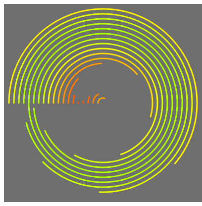

# TornadoWave
Tonado Waves is made in P5.js and takes inspiration from [https://www.openprocessing.org/sketch/152169](https://www.openprocessing.org/sketch/152169)

### Built With

* [P5.js](https://p5js.org) - The JavaScript library used